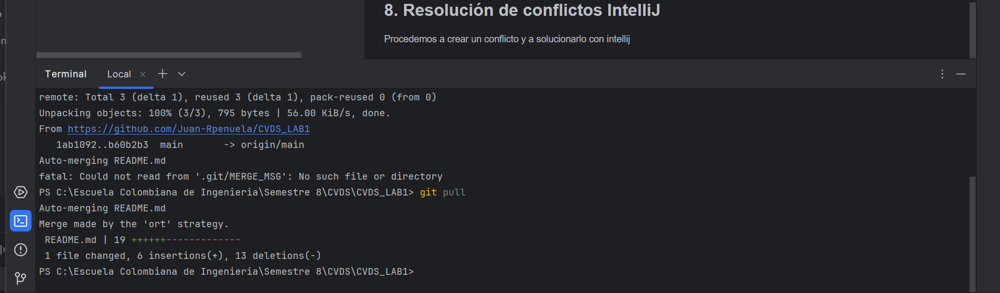
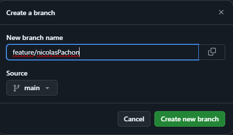
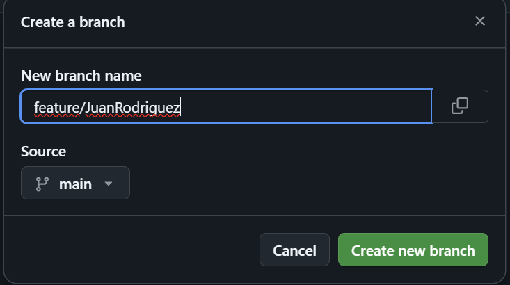
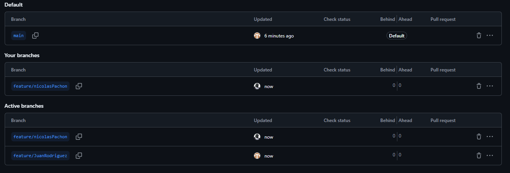
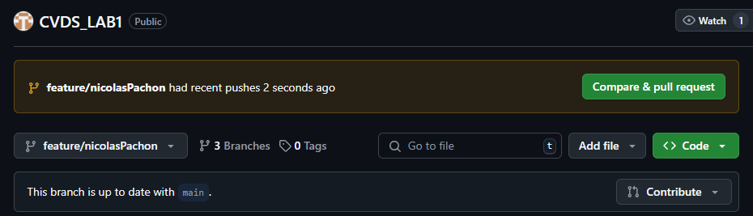
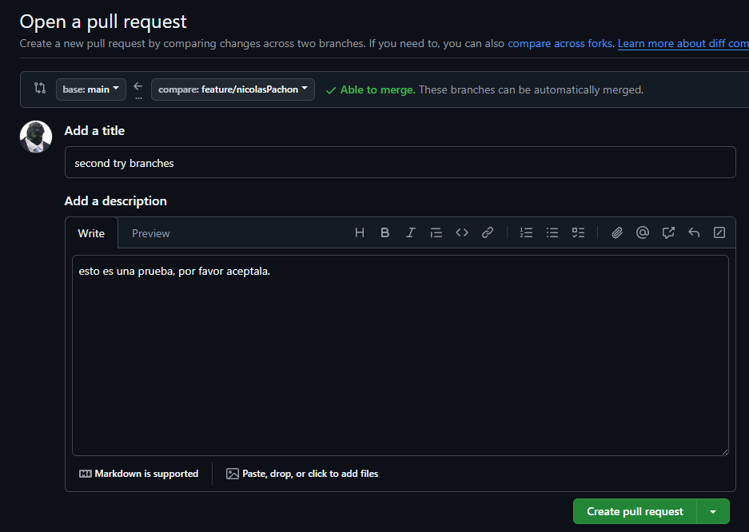
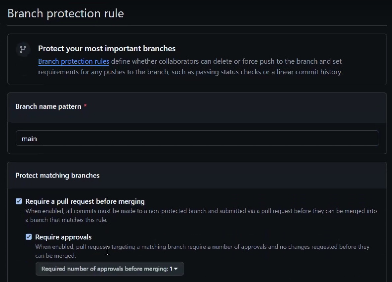
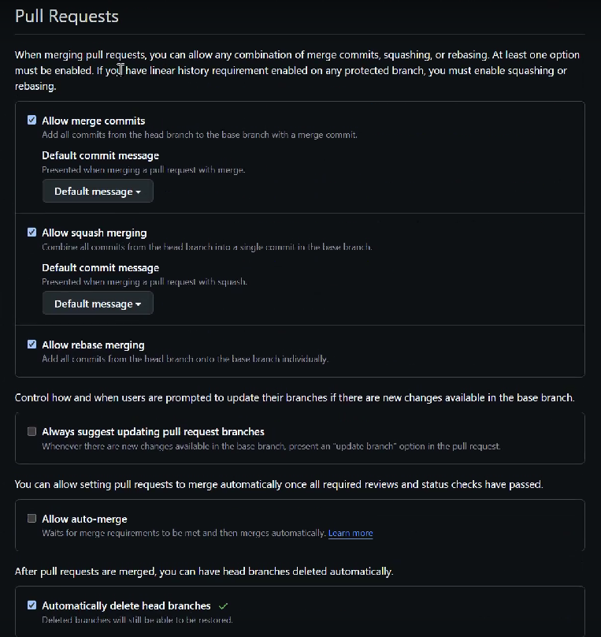

# Ciclos de Vida Laboratorio 1

## Bienvenidos al laboratorio 1 de Ciclos de vida de software
Para este laboratorio aprenderemos crear un Readme y a añadirlos  un repositorio creado por nosotros, haremos tambien nuestros primeros trabajos en equipo sobre un mismo repositorio.

## INTEGRANTES

- Juan Andres Rodriguez Peñuela
- Nicolás Pachón Unibio

## RESPUESTAS

### Parte I

#### ¿Para que sirve el comando "git add"?
Prepara los cambios realizados en la maquina local o zona de trabajo en el repositorio.

#### ¿Para que sirve el comando "git commit -m"?
Un commit sirve para guardar los cambios realizados en el area de trabajo añadidos previamente al historial el repositorio
el **-m** es utilizado para añadir un mensaje a este "punto de guardado".

### Parte II

#### 1. Definir el Owner y el Colaborador 
- Owner: Juan Andrés Rodríguez (Juan_Rpenuela)
- Colaborator: Nicolás Pachón (Cedab23)

#### 6. ¿Que sucedió?
Uno de los dos colaboradores del repositorio logró subir sus cambios, el otro no lo logró dando el problema de que los archivos en el repositorio tienen cambios los cuales no se tienen en la maquina local en la que se trabaja, tambien nos pide que hagamos un pull sobre el repositorio.

#### 7. Intento de pull y resolución de conflictos manuales
Al intentar hacer el pull del repositorio las persona que no logro subir sus cambios, aparece otro problema debido al contenido que se hizo en un archivo del repositorio antes de hacer el pull, por lo que si no se hace el merge automatico, debemos hacerlo nosotros manualmente

#### 8. Resolución de conflictos IntelliJ
Procedemos a crear un conflicto y a solucionarlo con intellij, al momento de hacer la resolución del conflicto y el merge del intellij este borro los cambios de uno de los contribuidores.

### Parte III

## 1.  ¿Hay una mejor forma de trabajar con git para no tener conflictos?
Una forma recomendada para trabajar en github es haciendo el uso de ramas, puesto que este permite hacer cambios y demás acciones en un ambiente aislado con respecto a la rama principal, generando que se pueda editar codigo y agregarlo sin interferir con los cambios generados por otras personas o colaboradores.
## 2.  ¿Qué es y como funciona el  **Pull Request**?
El pull request, como el nombre indica, es una solicitud que se realiza para poder subir a un repositorio los avances o modificaciones realizadas en una rama en especifico. Esta se solicita y una persona encargada debe revisar los archivos asociados al commit para decidir si integrar o no los cambios a una rama.

## Elaboracion del README

### Parte I

Esta se realizo de forma individual, en esta ocasion veremos un readme abarcando los puntos que se realizaron de forma grupal, en las ramas de cada integrante, se pueden ver los readme asociados a su trabajo individual

#### Prueba adjunta de que se realizo el readme en un editor de texto y no dentro de github

#### Cuenta de Github enlazada al correo institucional

### Parte II

#### 2. Invitación del Owner al Colaborador

	

#### 3. Invitación via teams

 
#### 4. El colaborador acepta la invitacion al repositorio

#### 5. Owner y colaborador intentan cambiar el readme a la vez

### Parte III

#### 3.  Creen una rama cada uno y suban sus cambios

#### Creación de la rama de Nicolás Pachón Unibio para comprobar comportamiento de cambios en git

#### Creación de la rama de Juan Andres Rodriguez Peñuela para comprobar comportamiento de cambios en git

#### Muestra de ambas ramas en el mismo repositorio

#### 4.   Tanto owner como colaborador hacen un cambio en el README.md y hacen un Pull Request (PR) a la rama main/master

#### 5.   Teniendo en cuenta la recomendación, mezclen los cambios a la rama main a través de PR con el check/review/approval del otro compañero (Cuando se hace merge se deberían borrar las ramas en github)

#### ***Aprobación Pull Request***

