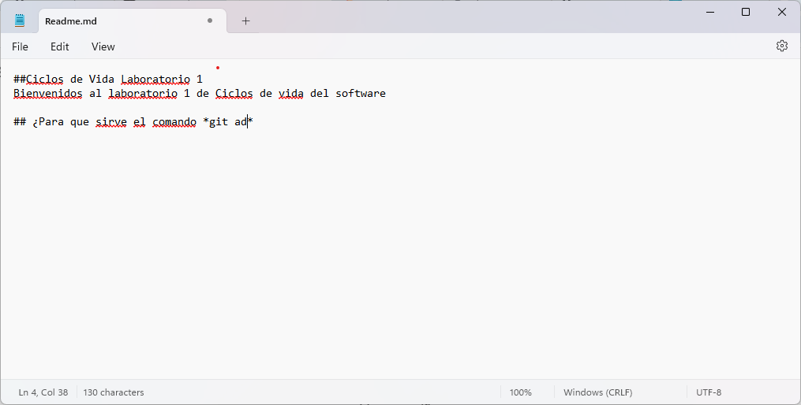
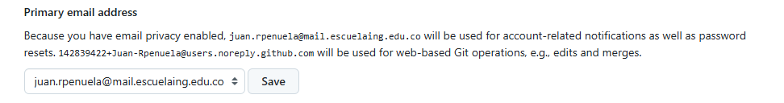
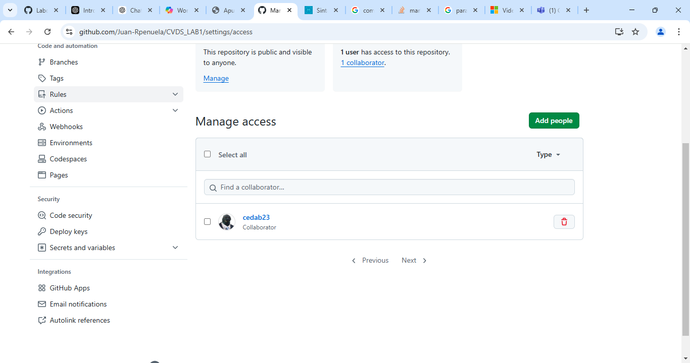
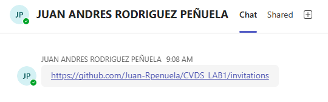
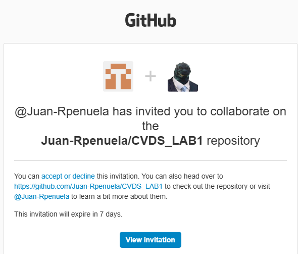
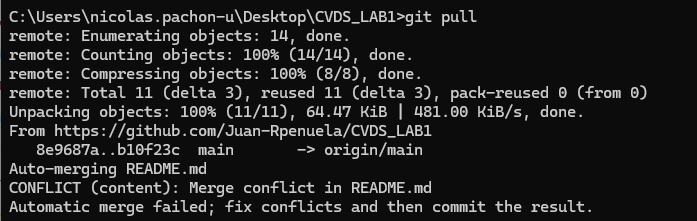

# Ciclos de Vida Laboratorio 1

## Bienvenidos al laboratorio 1 de Ciclos de vida de software
Para este laboratorio aprenderemos crear un Readme y a añadirlos  un repositorio creado por nosotros, haremos tambien nuestros primeros trabajos en equipo sobre un mismo repositorio.

# Parte I

## ¿Para que sirve el comando "git add"?
Prepara los cambios realizados en la maquina local o zona de trabajo en el repositorio.

## ¿Para que sirve el comando "git commit -m"?
Un commit sirve para guardar los cambios realizados en el area de trabajo añadidos previamente al historial el repositorio
el **-m** es utilizado para añadir un mensaje a este "punto de guardado".

## Elaboracion del README

## Cuenta de Github enlazada al correo institucional

# Parte II

## 1. Definir el Owner y el Colaborador 
- Owner: Juan Andrés Rodríguez (Juan_Rpenuela)
- Colaborator: Nicolás Pachón

## 2. Invitación del Owner al Colaborador

	

## 3. Invitación via teams

 
## 4. El colaborador acepta la invitacion al repositorio

## 5. Owner y colaborador intentan cambiar el readme a la vez

## 6. ¿Que sucedió?
Uno de los dos colaboradores del repositorio logró subir sus cambios, el otro no lo logró dando el problema de que los archivos en el repositorio tienen cambios los cuales no se tienen en la maquina local en la que se trabaja, tambien nos pide que hagamos un pull sobre el repositorio.

## 7. Intento de pull y resolución de conflictos manuales
Al intentar hacer el pull del repositorio las persona que no logro subir sus cambios, aparece otro problema debido al contenido que se hizo en un archivo del repositorio antes de hacer el pull, por lo que si no se hace el merge automatico, debemos hacerlo nosotros manualmente

## 8. Resolución de conflictos IntelliJ
Procedemos a crear un conflicto y a solucionarlo con intellij, al momento de hacer la resolución del conflicto y el merge del intellij este borro los cambios de uno de los contribuidores.

	

