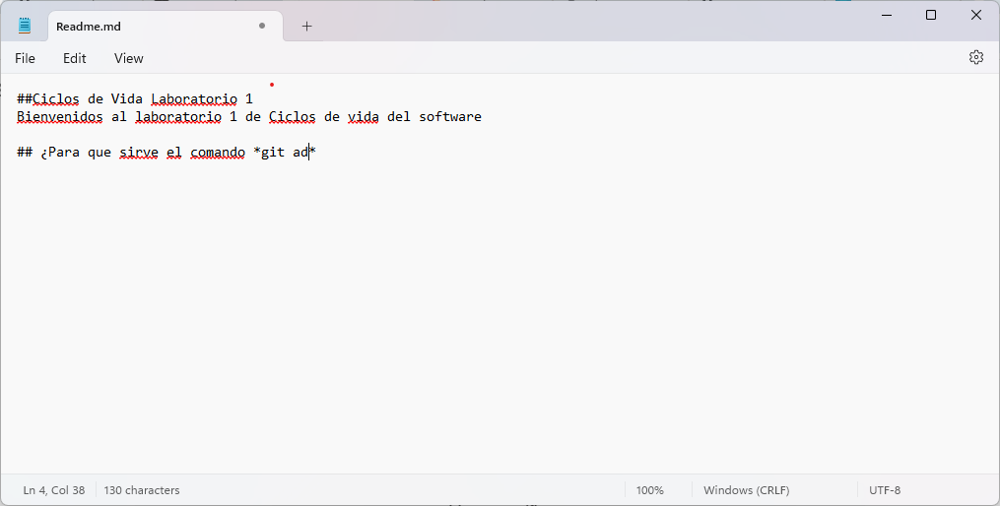

# Ciclos de Vida Laboratorio 1

## Bienvenidos al laboratorio 1 de Ciclos de vida de software
Para este laboratorio aprenderemos crear un Readme y a añadirlos  un repositorio creado por nosotros, haremos tambien nuestros primeros trabajos en equipo sobre un mismo repositorio.

## ¿Para que sirve el comando "git add"?
Prepara los cambios realizados en la maquina local o zona de trabajo en el repositorio.

## ¿Para que sirve el comando "git commit -m"?
Un commit sirve para guardar los cambios realizados en el area de trabajo añadidos previamente al historial el repositorio
el **-m** es utilizado para añadir un mensaje a este "punto de guardado".

## Elaboracion del README

	